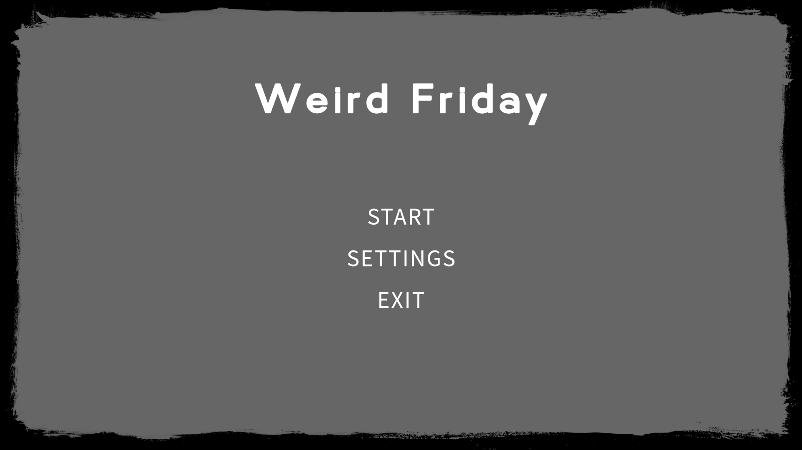
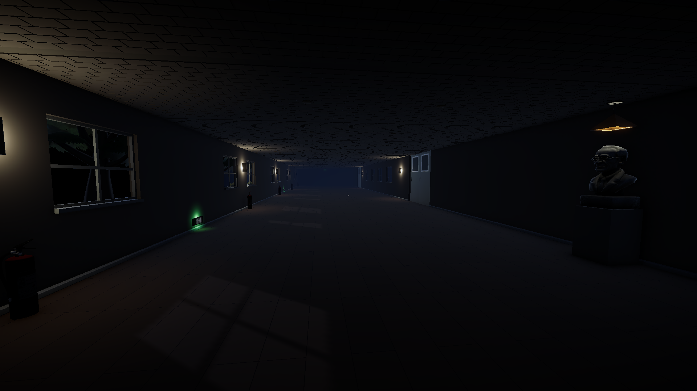
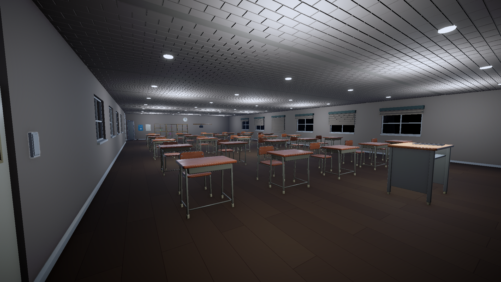
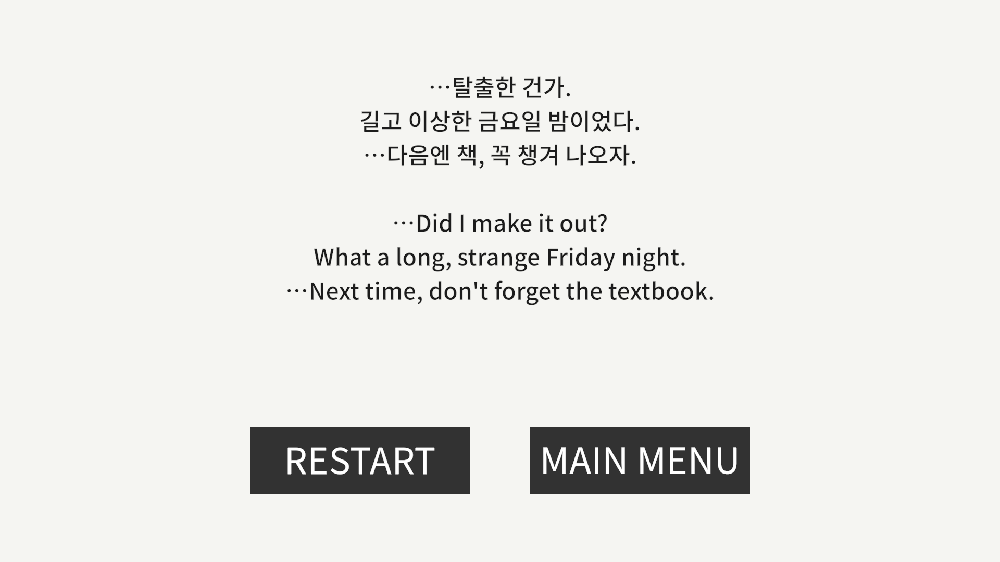
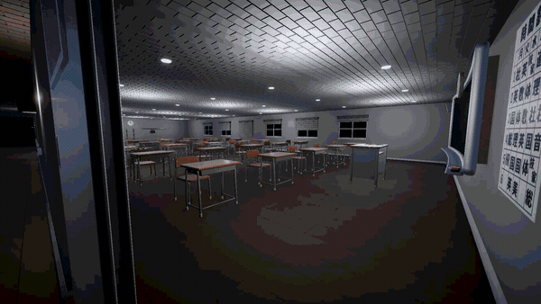
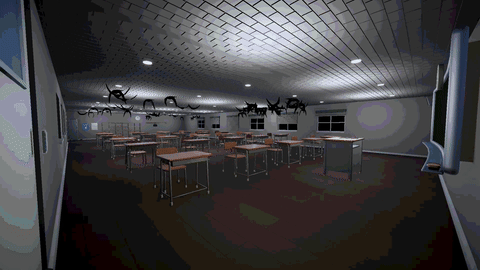
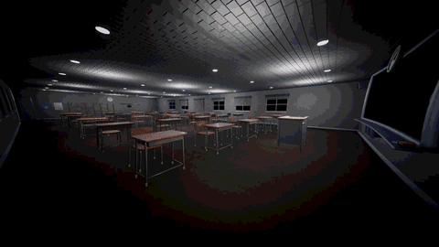

# Weird Friday

> 같은 복도를 반복해 걸으며 이상현상을 찾아, 되돌아갈지 전진할지 판단하는 1인칭 게임

`Unity 6000.3` · `C#` · `URP` · `Firebase` · `Input System`

> [!NOTE]
> **이 저장소는 개인 계정으로 옮겨 온 사본입니다.**
> 코드 · 커밋 · 버전 태그는 원본과 동일하지만, **PR과 프로젝트 보드는 저장소 간 이동이 불가능해 넘어오지 않았습니다.** 이슈는 옮겨졌으나 번호와 작성일이 옮긴 시점으로 다시 매겨졌습니다.
>
> 개발 과정(**머지된 PR 71건**, 이슈 19건, 리뷰 기록)은 원본 저장소에서 확인하실 수 있습니다 —
> [Devel-Rocket-ClassRoom/minigame-project-HanuYat](https://github.com/Devel-Rocket-ClassRoom/minigame-project-HanuYat)

|  |  |
| :---: | :---: |
|  |  |
| 타이틀 | 루프 공간 — 복도 |
|  |  |
| 교실 | 클리어 |

**기획부터 개발, STOVE 출시까지 1인으로 진행한 개인 프로젝트입니다.**

---

## 게임 소개

- 복도를 걷다가 **이상현상이 있으면 되돌아가고, 없으면 전진**합니다. 판단이 맞으면 카운터가 1 오르고, 틀리면 0으로 돌아갑니다
- 카운터가 8에 도달하면 출구가 열립니다. 이상현상은 복도에 들어설 때마다 50% 확률로 결정되며, 직전에 나온 항목은 연속으로 나오지 않습니다

<p align="center">
  <br>
  <b>복도 한 바퀴</b> — 관찰 · 판단 · 전환
</p>

## 조작

| 구분 | 키 |
| --- | --- |
| 이동 · 시점 | `WASD` · 마우스 |
| 앉기 | `C` |
| 상호작용 | `E` — 문 · 스위치 |
| 기타 | `Esc` 일시정지 · 설정 |

## 개발 환경

| 항목 | 내용 |
| --- | --- |
| 엔진 · 언어 | Unity 6000.3 (URP) · C# |
| 백엔드 | Firebase Authentication · Realtime Database |
| 기간 · 인원 | 2026.05 – 2026.06 · 1인 |
| 배포 | STOVE 출시 (v1.0.1) |

## 프로젝트 구조

```
Assets/Scripts/
├── Anomaly/       이상현상 계층 (AnomalyEffectBase) · 추첨 매니저
├── Corridor/      복도 전환 — 문 · 페이드 · 재추첨
├── Gameplay/      판정 카운터 · 클리어 · 피격 시퀀스
├── Interaction/   상호작용 인터페이스 · 레이캐스트 · 아웃라인
├── Player/        1인칭 이동 · 앉기
├── Settings/      감도 · 볼륨 영구화
├── Firebase/      인증 · 리더보드
├── UI/            카운터 · 페이드 · 메뉴 · 일시정지
└── Editor/        NavMesh 베이크 · 잔디 배치 툴
```

## 구현

### 1. 복도 하나로 만든 무한 루프

- **문제** — 복도를 계속 새로 만들면 메모리도 제작 시간도 감당이 안 됩니다
- **구조** — 복도 하나만 두고, 양 끝 문을 `E`로 열면 페이드 아웃 중간 시점에 플레이어를 시작 지점으로 옮기고 상태를 초기화합니다. 화면이 다시 밝아지면 다른 복도처럼 보입니다
- **한 지점에 모은 이유** — 위치 초기화 · 상호작용 오브젝트 리셋 · 이상현상 재추첨이 **페이드 중간 한 프레임에 함께** 일어나야 합니다. 셋 중 하나라도 밝아진 뒤에 실행되면 플레이어가 그 변화를 목격합니다

### 2. 이상현상을 계약으로 고정 — 17종

- `AnomalyEffectBase`가 `Activate()` / `Deactivate()`만 계약으로 두고, 각 이상현상은 그 안에서 자기 방식대로 동작합니다. 매니저는 구현을 모른 채 목록에서 하나를 고르기만 합니다
- 오브젝트 추가 · 제거, 색 변경, 조명 변화, 위치 · 회전, 스케일, 머티리얼 교체, 소리 이상, 화면 왜곡, 침수, 추격까지 **17종**으로 확장했고, 새 이상현상은 클래스 하나를 만들어 후보 목록에 넣으면 끝납니다

|  |  |
| :---: | :---: |
|  |  |
| 새 떼 — 앉아서 지나가면 안전 | 화면 노이즈 |

- **직전 항목 연속 방지** — 처음에는 "직전 것과 같으면 다시 뽑기" 방식이었는데, 후보가 2개인 구간에서 25% 확률로 같은 게 연속으로 나왔습니다. 후보 풀에서 최근 사용분을 **미리 걸러내는** 방식으로 바꿔 구조적으로 차단했습니다

### 3. Firebase 리더보드

- 익명 인증으로 계정을 만들고, **최단 클리어 시간**을 실시간 DB에 기록합니다
- 상위 100위 밖 사용자도 자기 기록과 등수를 볼 수 있도록 조회 경로를 따로 뒀습니다
- 닉네임은 예약 후 등록하고, 등록에 실패하면 예약을 되돌립니다. 중간에 끊겨 **쓰지 않는 닉네임이 잠기는 것**을 막기 위해서입니다
- 읽기 · 쓰기 범위를 보안 규칙으로 제한했습니다

### 4. 에디터 툴

- `NavMeshBakeHelper` — 교실 NavMesh 베이크를 메뉴 한 번으로
- `GrassScatter` — 외부 지형에 잔디를 규칙대로 배치. 밀도와 스케일 범위를 지정하고 건물 자리는 제외합니다

---

## 트러블슈팅

| 증상 | 원인 | 조치 |
| --- | --- | --- |
| 플레이를 끝내도 교실 조명이 비정상적으로 밝게 남음 | 공유 머티리얼에 직접 메서드를 호출해 에셋 파일이 영구 변경됨 | 렌더러마다 인스턴스를 1회 만들어 캐싱하고 참조만 교체. 공유 머티리얼 수정 금지를 프로젝트 규칙으로 문서화 |
| 전환 도중 다른 시퀀스가 끼어들면 화면이 검은 채로 멈춤 | 여러 시퀀스가 같은 페이드 컨트롤러를 공유해 뒤 호출이 앞 코루틴을 끊음 | 전환에 락을 걸어 교차 진입을 차단하고, 콜백이 예외를 던져도 페이드가 복구되도록 처리 |
| 릴리스 빌드 로그에 정답이 노출됨 | 이상현상 활성화 로그가 빌드에도 남아 어떤 이상현상이 켜졌는지 확인 가능 | 로그 헬퍼에 `[Conditional("UNITY_EDITOR")]`를 붙여 릴리스에서 호출 자체가 사라지도록 변경 |
| 문턱을 넘을 때 발소리가 연달아 터짐 | 접지 판정이 떨려 매 프레임 발소리가 재생됨 | 최소 간격 쿨다운 추가. 컷신 · 전환 중에는 발소리를 끔 |

## 플레이

[STOVE 스토어](https://store.onstove.com/ko/games/104969) — Windows

---

## 개발 기록

- 이슈 19건 · 머지된 PR 71건
- 모든 작업을 이슈 → 브랜치 → PR → 리뷰 → 머지로 진행했습니다
- 버전 태그: `0.1.0` (1주차) · `0.2.0` (2주차) · `0.3.0` (3주차) · `1.0.0` (출시) · `1.0.1`
